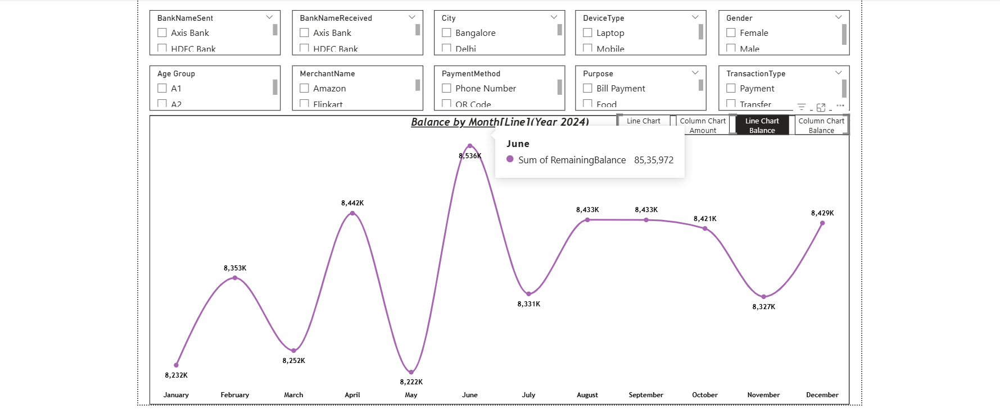
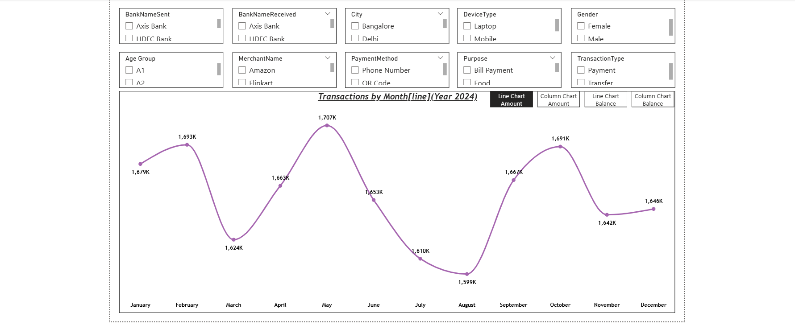
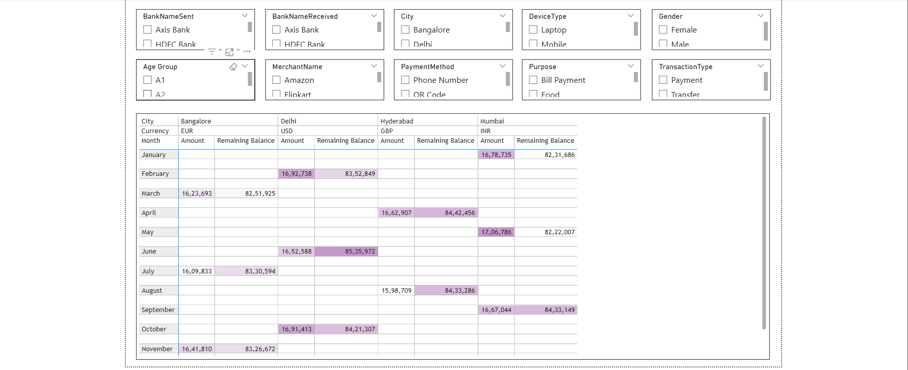

# 📊 UPI Transaction Data Analysis (Power BI Project)
📌 Project Overview

This project presents an interactive UPI Transactions Analysis Dashboard built using Power BI. It provides deep insights into transaction behavior across multiple dimensions such as bank usage, payment methods, demographics, and transaction trends over time.

The goal of this project is to analyze digital payment patterns and help understand user behavior in the UPI ecosystem.

🎯 Objectives

Analyze monthly transaction trends

Identify top banks used for sending and receiving money

Understand customer behavior based on age group and gender

Evaluate preferred payment methods and transaction types

Track spending patterns across different merchants and purposes

📂 Dataset Description

The dataset includes the following key attributes:

Transaction Details: Transaction ID, Date, Time, Amount

Bank Information: BankNameSent, BankNameReceived

User Information: Age, Age Group, Gender

Transaction Context:

Payment Method (Phone Number, QR Code, etc.)

Transaction Type (Payment, Transfer)

Purpose (Food, Bills, Shopping, etc.)

Device & Location: Device Type (Mobile/Laptop), City

Financial Info: Remaining Balance

📊 Dashboard Features
🔹 Interactive Filters (Slicers)

Bank (Sent & Received)

City

Device Type

Gender

Age Group

Merchant Name

Payment Method

Purpose

Transaction Type

📈 Visualizations

Monthly Transaction Trend (Line Chart)

Amount vs Balance Comparison (Line & Column Charts)

Category-wise Analysis (Purpose, Merchant, Payment Mode)

Demographic Insights (Age Group, Gender)

Bank Usage Analysis

🔄 Bookmark Navigation

The dashboard uses Power BI Bookmarks to switch between:

Line Chart (Amount)

Column Chart (Amount)

Line Chart (Balance)

Column Chart (Balance)

This provides a dynamic and interactive user experience without cluttering the dashboard.

🛠️ Tools & Technologies Used

Power BI – Data Visualization & Dashboarding

Excel / CSV – Data Source

DAX (Data Analysis Expressions) – Calculated measures and KPIs

💡 Key Insights

Transaction volumes fluctuate monthly with noticeable peaks and dips

Certain banks dominate UPI transactions

Mobile devices are the primary mode of transaction

Specific purposes like food and bill payments are most frequent

Payment methods like QR code and phone number are widely used

📸 Dashboard Preview

🚀 How to Use

Download the .pbix file

Open in Power BI Desktop

Interact with slicers and bookmarks to explore insights

📌 Future Improvements

Add predictive analysis (forecasting trends)

Integrate real-time data

Enhance UI/UX with advanced visuals

Add KPI cards for quick insights
